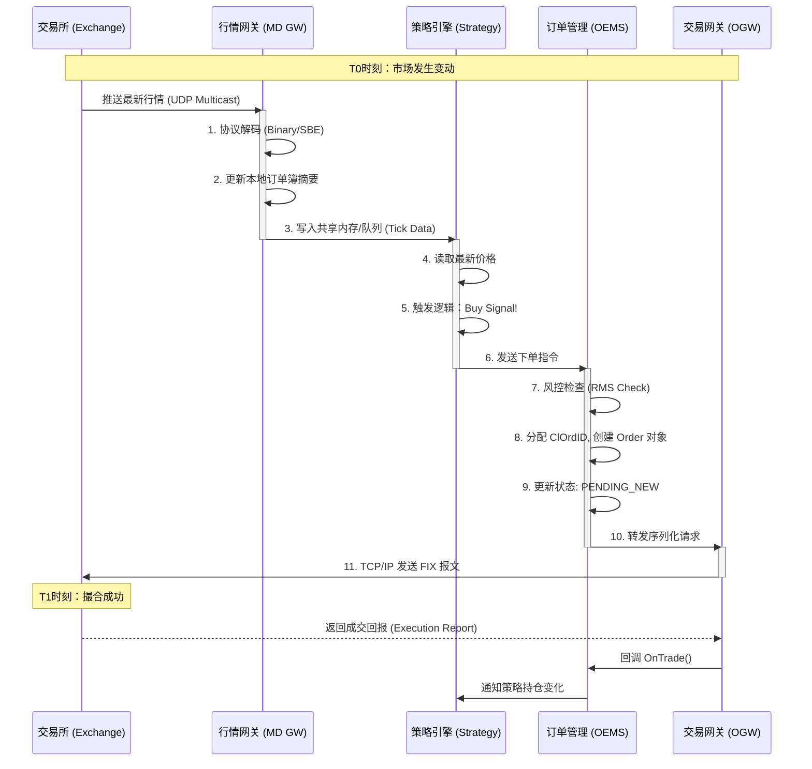

# C++ 高频交易系统开发指南：从入门到精通

**作者**：资深系统架构师  
**日期**：2026-03-03  
**适用对象**：系统编程实习生、初级量化开发工程师

---

## 1. 交易系统分层架构视图

一个成熟的高频交易系统（HFT）并非单体应用，而是深度依赖底层硬件与操作系统的复杂分层架构。每一层都在为“**极致速度**”这一核心目标服务。

```text
================================================================================
Level 1: 业务应用层 (Application Layer)
--------------------------------------------------------------------------------
[ 策略引擎 (Strategy) ] <----> [ 算法交易 (Algo/Smart Execution) ]
         ^                                   |
         | (Signal)                          | (Order Instruction)
         v                                   v
[ 行情网关 (MdGateway) ]        [ 交易网关 (OrderGateway/OMS) ]
         ^                                   |
         | (Market Data)                     | (FIX/Binary Protocol)
         +-----------------------------------+
                          |
================================================================================
Level 2: 核心基础设施层 (Infrastructure Layer)
--------------------------------------------------------------------------------
[ 消息总线 (IPC/Bus) ] : 共享内存(SHM) / 无锁队列(RingBuffer) / 组播(Multicast)
[ 基础组件库 (Core Lib) ]: 内存池(MemPool) / 日志(Logger) / 序列化(Codec)
================================================================================
Level 3: 操作系统与网络层 (OS & Network Layer)
--------------------------------------------------------------------------------
[ OS Kernel Bypass ]: OpenOnload / DPDK / RDMA
[ CPU Isolation ]: 核绑定 (Core Pinning) / 隔离 (Isolcpus)
================================================================================
Level 4: 硬件层 (Hardware Layer)
--------------------------------------------------------------------------------
[ FPGA加速卡 ] -> [ 极速网卡 (Solarflare/Mellanox) ] -> [ 高频服务器 (Overclocked) ]
```

---

## 2. 架构设计的核心原则

在交易系统设计中，我们遵循 **"快、准、稳"** 三大原则，其中 **"快" (低延迟)** 是 C++ 系统的灵魂。

### 2.1 极致低延迟 (Ultra-Low Latency)
*   **纳秒必争**：普通互联网应用优化的是毫秒 (ms)，交易系统优化的是微秒 (μs) 甚至纳秒 (ns)。
*   **关键路径优化**：从收到行情包到发出订单包的路径（Critical Path）上，指令数越少越好。
*   **数据本地化**：尽量让数据停留在 CPU 的 L1/L2 缓存中，减少访问主存（DRAM）的次数（Cache Miss 是性能杀手）。

### 2.2 确定性 (Determinism)
*   **拒绝抖动**：系统响应时间的**方差**比**均值**更重要。如果是 99% 的请求 1μs，但有 1% 的请求 100ms，这个系统就是失败的。
*   **零干扰**：消除所有操作系统层面的干扰，如页面换入换出 (Page Fault)、上下文切换 (Context Switch)、系统中断 (IRQ)。

### 2.3 高可用与强一致性 (Availability & Consistency)
*   **资金安全**：订单状态必须严格一致，绝不能出现“幻影成交”或“丢单”。
*   **灾难恢复**：当进程崩溃时，必须能在极短时间内（<1秒）把内存状态完全恢复，继续交易。**这也是本实习课题（内存快照）存在的根本意义。**

---

## 3. C++ 系统设计要点与黑科技

为了实现上述原则，C++ 交易系统在实现上有一套独特的“最佳实践”。

### 3.1 内存管理：拒绝 `new/malloc`
*   **静态预分配**：系统启动时一次性申请几 GB 内存。
*   **对象池 (Object Pool)**：所有订单 (`Order`)、行情 (`Tick`) 对象都从预先分配的数组中取用。
    *   *好处 1*：分配时间复杂度 O(1)。
    *   *好处 2*：内存地址连续，极大提升 CPU 缓存命中率。
    *   *好处 3*：避免内存碎片。

### 3.2 线程模型：单线程与无锁化
*   **Thread-per-Core**：一个核心只跑一个线程，绑定 CPU 亲和性 (`pthread_setaffinity_np`)。
*   **无锁编程 (Lock-Free)**：
    *   **严禁**使用 `std::mutex`, `std::condition_variable` 等重量级锁。
    *   **替代方案**：使用原子变量 (`std::atomic`) 和内存屏障 (`memory_order`)。
    *   **SPSC 队列**：线程间通信使用单生产者单消费者 (Single-Producer-Single-Consumer) 的环形队列 (Ring Buffer)，实现零拷贝通信。

### 3.3 网络优化：内核旁路 (Kernel Bypass)
*   **传统网络**：网卡 -> 中断 -> 内核协议栈 -> 拷贝 -> 用户态 (延迟 > 10μs)。
*   **交易网络**：网卡 -> DMA直接写内存 -> 用户态轮询 (延迟 < 2μs)。常用库：`efvi` (Solarflare), `ibverbs` (Mellanox)。

### 3.4 数据结构：为硬件而设计
*   **Cache Line 对齐**：结构体大小尽量对齐到 64 字节，并在多线程共享变量间添加 Padding，防止**伪共享 (False Sharing)**。
*   **侵入式数据结构**：如 `Intrusive List`，将链表指针直接嵌入业务对象中，避免额外的内存节点分配。

---

## 4. 交易整体全链路流程

让我们跟踪一个“限价买单”在系统中的全生命周期：



---

## 5. 本实习课题的实现方案与技术价值

在上述架构中，**撮合引擎 (Matching Engine)** 虽然通常位于交易所侧，但很多高频团队内部也会维护一个“影子撮合引擎”来预估成交概率。本课题实现的正是这样一个组件的核心部分。

### 5.1 核心需求
系统在高速运行（每秒处理 10 万单）时，如何把当前的 2GB 内存状态保存到硬盘，且**不能让交易主线程停顿超过 1 毫秒**？

### 5.2 技术选型：Fork + COW
利用 Linux 操作系统的 COW (Copy-On-Write) 机制。

| 方案 | 原理 | 延迟影响 | 缺点 | 适用性 |
| :--- | :--- | :--- | :--- | :--- |
| **同步拷贝** | `stop world` -> `memcpy` -> `resume` | 极高 (>500ms) | 业务完全停摆 | 不可用 |
| **异步日志** | 记录每条指令到 Log | 低 | 恢复慢，需要重放所有日志 | 辅助手段 |
| **Fork快照** | **复制页表** -> **子进程后台写盘** | **极低 (<1ms)** | 占用双倍虚拟内存 | **最佳实践** |

### 5.3 实现步骤
1.  **构建撮合核心**：实现 OrderBook，支持 Limit/Cancel 指令。
2.  **触发快照**：主线程调用 `fork()`。
3.  **父进程**：立即返回，继续撮合。遇到写操作时触发 OS 的缺页中断（Page Fault），复制 4KB 物理页。
4.  **子进程**：获得父进程此刻的“静态视图”，遍历内存，格式化写入磁盘文件。
5.  **恢复验证**：重启程序，加载快照文件 + 增量日志，验证由于 Hash/Pointer 带来的内存重构问题。

### 5.4 学习目标
通过本课题，你将深入理解：
*   Linux 虚拟内存管理机制 (VMA, Page Table)。
*   高性能 C++ 数据结构的设计 (SkipList, Object Pool)。
*   如何编写对 OS 调度友好的代码。

---
*注：本文档旨在建立知识体系，具体编码细节请参考设计文档。*
