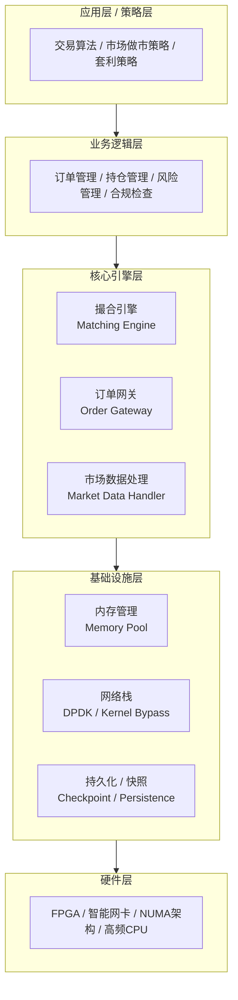
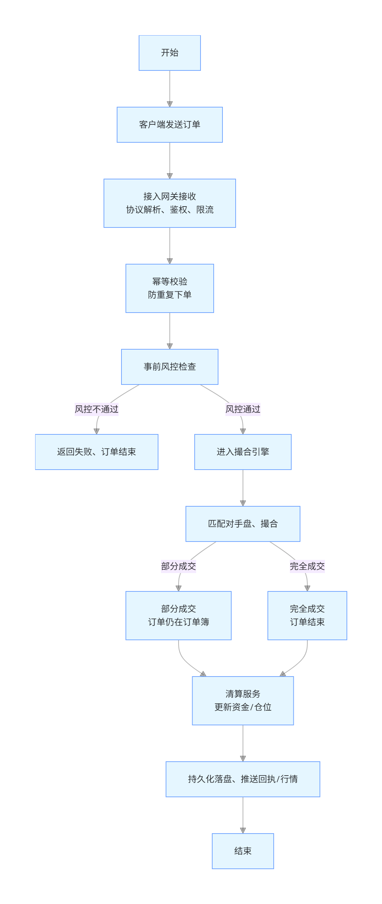
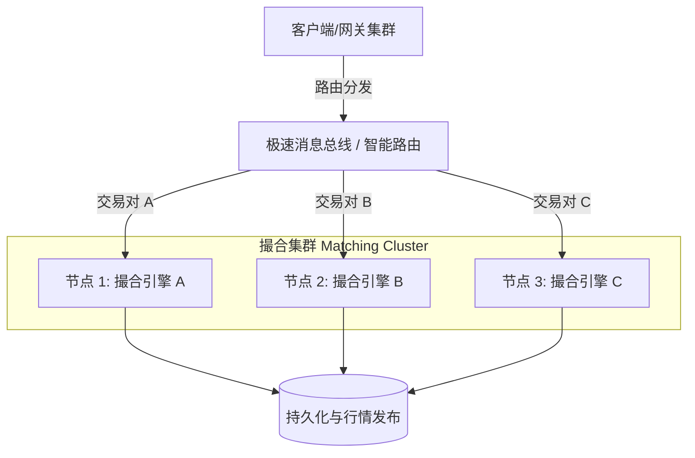
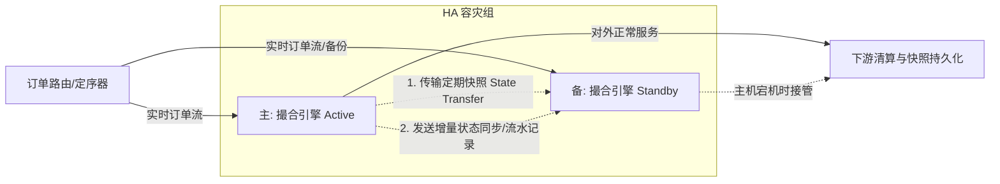
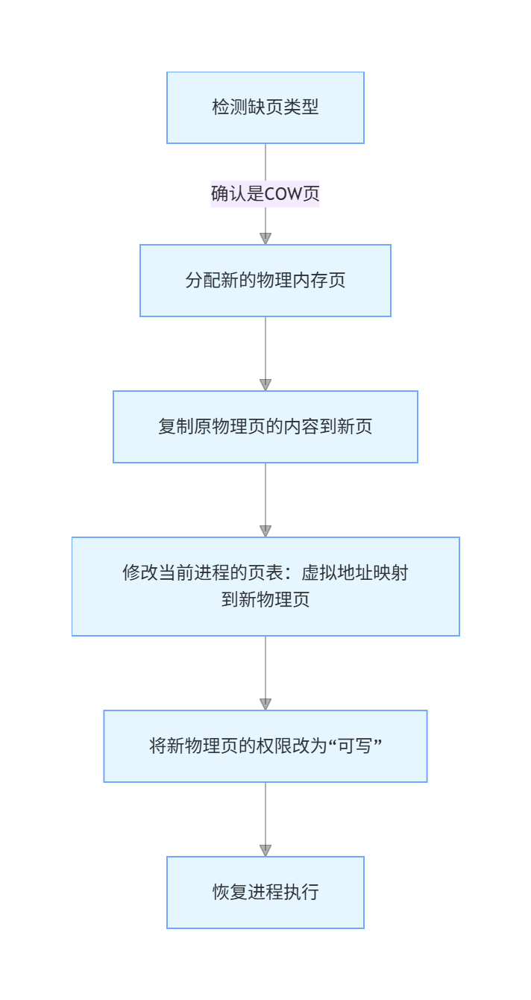
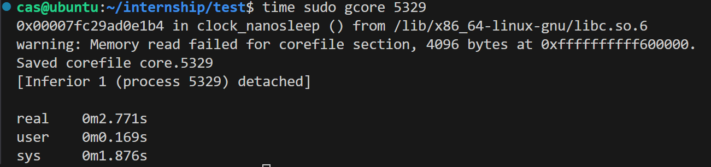

# 内存快照技术调研笔记

**课题：** 交易系统快速内存快照方案调研与原型实现
**阶段：** 第一周产出物
**环境：** Linux 系统

---

## 1. 内存快照基础概念

**内存快照（Memory Snapshot）**是指在特定时间点捕获和保存一个进程或系统的内存状态的过程。它包含了当前内存中所有数据的副本，包括正在运行的程序、数据结构、变量值等。内存快照通常用于调试、性能分析、故障排除以及系统恢复等场景。在交易系统中，通过分析和加载内存快照，可以实现系统故障的快速恢复、状态回滚与回测，以及跨节点的状态同步。

### 1.1 交易系统场景下的核心诉求
在低延迟交易系统（如撮合引擎）中，快照机制有着极为严苛的要求：
*   **低侵入性与极速生成**：快照生成操作造成的停顿（STW, Stop-The-World）耗时必须 **< 1ms**，严禁阻塞核心撮合程序，否则会导致严重的订单延迟。
*   **快速恢复**：灾备恢复时间需 **< 50ms**。
*   **强一致性**：导出的快照数据前后必须严格一致，确保恢复后的账户金额、持仓和订单簿状态绝对正确。

### 1.2 交易系统基础框架与订单生命周期

在深入探讨快照方案之前，需要先明确交易系统的基本运转流程和分层架构。只有了解了数据流转，才能在不影响主链路的地方进行快照兜底。

*   **交易系统一般框架（分层架构）**：
    现代极速交易系统通常遵循严格的分层架构设计，各层职责明确，以追求极致的吞吐和极低的延迟。自上而下可分为：
    1. **应用层（策略层）**：运行交易算法、做市及套利策略，是交易流的起点。
    2. **业务逻辑层**：负责订单生命周期流转、持仓状态维护及盘前风控与合规检查。
    3. **核心引擎层**：包含最为核心的撮合引擎（全内存处理）、订单网关（接入）以及市场数据处理引擎。
    4. **基础设施层**：提供底层系统支撑，包含定制化的内存管理（Memory Pool）、绕过内核态的极速网络栈（DPDK / Kernel Bypass），以及我们此次重点关注的**持久化与快照模块（Checkpoint / Persistence）**。
    5. **硬件层**：基于 FPGA、智能网卡，配合 NUMA 架构绑定和高频 CPU 提供极速底座支撑。

    在上述架构中，“核心引擎层”和“业务逻辑层”的高频状态（如订单簿、资金池、持仓）均在内存中直接构建及流转。这也构成了我们需要通过“基础设施层”的快照模块，进行数据兜底和灾备 Core 恢复的核心标的。

*   **订单全生命周期**：
    一笔订单从游离态到终态，生命周期极为紧凑：从客户端发起 -> 经过网关安全鉴权与预风控 -> 穿透进撮合引擎 -> 修改账户资金预留 -> 挂入订单簿队列（OrderBook）或直接与反向订单匹配成交 -> 生成成交回报流水（Trade）事件驱动下游。在这个链条中，每个时钟周期的状态都稍纵即逝，这要求快照动作既不能成为流水线的阻塞点，又要能够准确捕捉一瞬间各模块数据强一致性的横截面。
    

### 1.3 交易系统的集群部署与高可用主备架构

在真实的生产环境中，单个撮合引擎的吞吐量有限，且存在单点故障风险。因此，交易系统往往采用**分布式集群部署（水平扩展）**配合**主备容灾（高可用）**的整体架构。这也是内存快照技术的核心应用场景之一：跨节点状态迁移与灾备恢复。

*   **集群分片架构（Sharding）**：
    由于极速撮合引擎通常采用“单线程绑核、无锁化”设计，无法通过多线程扩展单对交易的性能。为了提升整个市场的吞吐量，系统会按照**交易对（Symbol / Instrument，如 BTC/USD、ETH/USD）进行分片（Sharding）**。一个网关将报单路由到对应品种的独立撮合节点上独立处理。

*   **高可用主备架构（Active-Standby / HA）**：
    对于任意一个特定的交易对节点，为了防止机器宕机或断网导致瘫痪，通常配置“一主多备”。在这里，**异步内存快照扮演了“保命底座”的关键角色**。
    备机在启动时，首先需要加载主机生成的**全量内存快照**建立基准状态；随后通过重放日志（Journaling / WAL）或接收主机的内存增量快照来实现精准同步。一旦主机宕机，备机可以凭借自身的完备内存状态在毫秒级接管（Failover），做到上层无感。

---

## 2. Linux 内存管理机制浅析

为了设计高效的快照方案，必须深入理解 Linux 底层的内存分配与管理机制。

### 2.1 虚拟内存与页表 (Page Table)
Linux 采用虚拟内存管理技术，每个进程拥有独立的虚拟地址空间。虚拟地址通过**页表（Page Table）**映射到实际的物理内存页。
*   深入理解可参考：[虚拟内存管理基础](https://xiaolincoding.com/os/3_memory/vmem.html)、[内核官方文档](https://docs.kernel.org/next/translations/zh_CN/mm/page_tables.html)。

### 2.2 内核状态探针：/proc 文件系统
`/proc` 是 Linux 内核提供的伪文件系统（procfs），存在于内存中，是内核与用户态交互的接口，可实时反映系统与进程状态。
*   **/proc/[pid]/maps**：显示指定进程的虚拟内存映射情况（起始地址、权限、偏移等），用于梳理进程内存布局。
*   **/proc/[pid]/mem**：提供对指定进程虚拟内存的直接访问接口。拥有权限（通常需 root）便可通过 `lseek` 定位读取或写入内存内容。

### 2.3 Fork 与写时复制 (Copy-On-Write, COW)
如果 `fork` 直接复制父进程的所有物理内存，将消耗极大的 CPU 和内存带宽，尤其是当子进程立刻执行 `exec` 时更是极大的浪费。因此 Linux 引入了 **Copy-On-Write (COW)** 机制：
*   **机制原理**：`fork` 后，父子进程初始共享同一份物理内存页，内核将这些页的权限标记为“只读”。
*   **缺页异常**：当任意进程尝试修改数据时，由于权限不足会触发缺页异常（陷入内核态）。
*   **按需复制**：内核此时单独为该进程复制一份需要修改的内存页，将其权限设为可写。该进程即可修改属于自己的独立内存副本，而另一进程依然访问原页。

---

## 3. 外部工具内存导出实验：gcore 局限性分析

传统的系统运维常常使用 `gcore` 等工具来导出进程内存，但在低延迟交易系统中，这种方案被证明是不可行的。

### 3.1 实验观测
我们编写了一个内存占用模拟程序（持续申请内存并写入，模拟 1GB~2GB 占用）进行实验：
1.  **权限限制**：Linux 默认开启 Ptrace 保护机制，普通执行 `gcore [pid]` 会报错，必须使用超级用户权限（sudo）。
2.  **严重阻塞**：执行 `time sudo gcore [pid]` 观测阻塞耗时。当内存占用达到 2GB 时，目标进程**被完全卡住等待了 2 秒多**。

### 3.2 局限性原因深度剖析
`gcore` 的设计初衷是为了**捕获进程内存现场用于离线调试**（如生成 coredump），而非用于在线系统的低延迟快照与容灾。其底层机制完全违背了低延迟系统的诉求：

1.  **破坏确定性（强制冻结）**：首步机制是向目标进程发送 `SIGSTOP` 信号，强制冻结所有线程，直到整个数百 MB/GB 级别的全量转储完成，才发送 `SIGCONT` 恢复。这会导致不可控的业务大面积阻塞。
2.  **重型系统调用侵入**：依赖核心为调试设计的 `ptrace` 重型系统调用（如 `PTRACE_ATTACH`），强侵入且高开销。
3.  **IO 放大与全量拷贝**：同步遍历 `/proc/[pid]/maps` 并全量拷贝每一段可读内存。不仅耗时，而且大量冷数据（历史记录、配置）也被迫重复写入，IO 占用极高。
4.  **资源争用与缓存污染**：全量内存拷贝耗尽内存带宽，严重污染 CPU Cache，同时大量磁盘 IO 会直接拖垮业务进程的访问延迟。
5.  **恢复极其缓慢**：快照恢复需要解析 ELF core 格式、重映射内存、恢复寄存器/线程状态等。对于大内存进程，恢复通常耗时数秒甚至数十秒，远超数十毫秒的容灾标准。

---

## 4. 低延迟场景下的快照替代方案调研

针对 `gcore` 的缺陷，主流高吞吐/低延迟系统通常采用以下三种维度的快照方案：

### 4.1 方案一：用户态写时复制 (COW) 机制（本次原型目标）
基于业务层面的内存页分级管理：
*   内存划分为“快照页”和“业务页”，维护“引用计数”和“脏标记”。
*   触发快照时，仅标记所有页为“只读”（微秒级）。
*   后台线程异步持久化快照区数据。
*   业务写操作遇只读页时，在用户态复制原页供快照使用，业务页使用新副本。

### 4.2 方案二：分代增量快照
按数据变更频率分级：
*   **L0（静态数据）**：配置、静态结构，仅启动/变更时全量快照。
*   **L1（温数据）**：资金、持仓，分钟级增量快照。
*   **L2（热数据）**：实时订单、成交流，百毫秒级内存环形缓冲区增量记录。
恢复时按 L0 -> L1 -> L2 顺序快速重放。

### 4.3 方案三：硬件辅助快照（极限低延迟）
*   **RDMA 内存镜像**：利用 RDMA 网卡将本地内存实时镜像至备机，CPU 零开销。
*   **PMEM (Intel Optane)**：基于字节级寻址+持久化特性，直接写入持久内存，恢复时无需拷贝直接访问。
*   **NVMe SSD DAX**：绕过内核 Page Cache，直接通过内存映射对 NVMe 进行微秒级 IO。

### 4.4 方案综合对比

| 方案 | 快照生成耗时 | 性能侵入 | 恢复耗时 | 成本 | 适用场景 |
| :--- | :--- | :--- | :--- | :--- | :--- |
| **用户态/系统 COW** | 微秒级 | < 1% | < 50ms | 低 | 通用低延迟系统（如标准撮合引擎） |
| **分代增量快照** | 微秒级 | < 0.5% | < 30ms | 中 | 分层明显的体系（如交易中心与清算） |
| **硬件辅助快照** | 纳秒级 | 0 | < 10ms | 极高 | 极限高频交易 (HFT) |

---

**下周计划**：基于上述调研结果，将进入内部代码优化路线，尝试基于 Linux `fork()` 系统调用（利用内核 COW 机制）直接在撮合引擎原型内部实现异步快照机制，并进行性能对比验证。