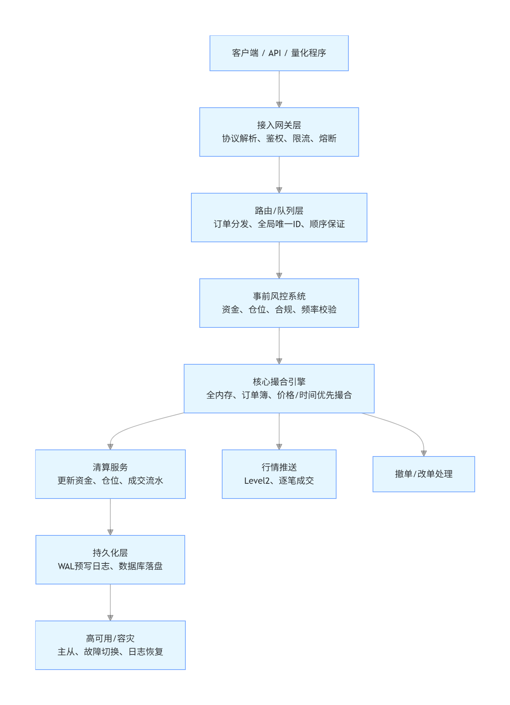

# 课题实习日记

**实习人**：何梓豪
**实习周期**：3周
**课题性质**：系统编程 / 性能优化

## 计划步骤
### 第一周：技术调研与方案验证
**本周重点**：理解问题，熟悉 Linux 内存机制，并通过手动实验验证“为什么直接拷贝内存行不通”。

**笔记**：
1. Linux的虚拟内存管理、页表（Page Table）：
    - 豆包详细分析：https://www.doubao.com/chat/38415293971474178
    - 虚拟内存管理基础（小林coding）：https://xiaolincoding.com/os/3_memory/vmem.html
    - 深入内核分析：https://www.wowotech.net/memory_management/
    - 陈丽君-内核管理专栏：https://kerneltravel.net/column/memory/
    - 官方中文文档：https://docs.kernel.org/next/translations/zh_CN/mm/page_tables.html
2.  `/proc/[pid]/maps` 和 `/proc/[pid]/mem` 的作用:
    - /proc 是 Linux 内核提供的伪文件系统（procfs），它挂载在 /proc 路径下，核心特点和作用如下：不是真实磁盘文件系统：/proc 下的所有文件 / 目录都不存储在硬盘上，而是内核在内存中动态生成的 “虚拟文件”；内核与用户态的交互接口：它的核心作用是向用户态程序（比如 ps、top、lsof 等工具）暴露内核状态、系统信息、进程运行时数据，用户也可以通过读写部分 /proc 文件（需权限）修改内核 / 进程的运行参数；内容实时更新：每次访问 /proc 下的文件，内核都会实时查询当前系统 / 进程状态并返回结果，而非读取静态文件.
    - /proc/[pid]/maps：显示指定进程的虚拟内存映射情况，包括每个内存区域的起始地址、结束地址、权限、偏移量、设备号、inode 以及对应的文件路径（如果有）。它帮助我们了解进程的内存布局和使用情况。
    - /proc/[pid]/mem：提供对指定进程虚拟内存的直接访问接口。通过打开这个文件并使用 lseek 定位到特定地址，我们可以读取或写入该进程的内存内容。需要注意的是，访问 /proc/[pid]/mem 需要足够的权限（通常是 root 权限），并且在某些系统中可能会受到安全限制。
3. `fork` 系统调用的 Copy-On-Write（写时复制）原理：
    - 需要写时复制的原因：`fork`系统调用没有写时复制的时候会直接复制父进程的整个内存空间，子进程拥有独立的与父进程相同的内存副本，导致需要消耗大量的CPU时间和内存带宽，效率低下，如果子进程立即调用`exec`执行新程序，那么之前复制的内存空间就完全浪费了。
    - 写时复制：先共享，写的时候再复制，父子进程一开始共享一份物理内存页，且权限为只读，当父子进程中某一个需要修改时，内核单独为该进程复制一份需要修改的内存页，设置为可写，该进程就可以修改自己的独立内存副本了
    - 因为权限不对，发生缺页异常，陷入内核
    
4. 外部工具实验：
    - 直接执行 `gcore [pid]` 会报错，因为Linux系统默认开启了Ptrace保护机制，限制了一个进程调试或者读取另一个进程内存的能力，即使是同一个用户，需要使用超级用户权限.
    - 当内存占用到达2GB时，在别的进程中使用 `gcore` 导出内存需要等待2秒多。
    - 内存模拟程序中计算程序被卡住的时间：
    
    - 使用time sudo gcore [pid]命令可以直接测量执行gcore命令的时间:
    
    - `gcore`在低延迟场景下的局限性分析：
        - `gcore`的设计目标是捕获进程内存现场用于离线调试，而不是低延迟系统需要的在线无阻塞快照 + 毫秒级故障恢复，其底层实现机制无法满足低延迟系统的核心诉求。
        - `gcore`的执行流程：1.向目标进程发送SIGSTOP信号，暂停进程的所有线程执行，直到整个 dump 完成才会恢复；2.通过ptrace系统调用附加（PTRACE_ATTACH）到目标进程，读取寄存器、进程描述符、虚拟内存布局（/proc/[pid]/maps）；3.遍历进程的所有虚拟内存区域，同步读取每一段可读内存（代码段、数据段、堆、栈、共享库等），全量拷贝到用户态缓冲区；4.按照 ELF core 格式，将内存数据、寄存器状态等写入磁盘文件；5.ptrace分离进程，发送SIGCONT信号，恢复进程运行。
        - 低延迟不可用的原因：1.强制冻结进程，造成不可控的业务阻塞，完全破坏了确定性；依赖 ptrace 重型系统调用，强侵入性、高开销，这个接口本身就是为调试设计的；3.全量内存拷贝，无增量能力，IO 开销不可控，一些冷数据，配置信息，历史成交记录都不需要重复全量快照；4.恢复耗时长，无法满足低延迟容灾要求，恢复时需要用 GDB 加载，解析 ELF 格式、重映射内存、恢复寄存器和线程状态，这个过程哪怕是小内存进程也要数百 ms，大内存进程甚至需要几十秒，完全达不到容灾恢复的要求；5.一致性实现方式过于粗暴，不适合在线业务，gcore 的一致性，完全靠冻结整个进程实现，阻塞业务；6.会占用额外的资源，破坏低延迟运行环境，全量内存拷贝会耗尽内存带宽，导致业务进程的内存访问延迟升高，CPU 缓存被严重污染，大文件同步会占用大量的磁盘IO资源，导致业务进程的磁盘访问延迟升高。
5. 补充知识：
    - 内存快照：内存快照（Memory Snapshot）是指在特定时间点捕获和保存一个进程或系统的内存状态的过程。它包含了当前内存中所有数据的副本，包括正在运行的程序、数据结构、变量值等。内存快照通常用于调试、性能分析、故障排除以及系统恢复等场景。通过分析内存快照，开发人员可以了解程序的运行状态、发现潜在的问题，并进行优化。
    - 订单全生命周期
    
    - 交易系统一般框架
    
    - 低延迟场景下内存快照方案调研：
        - 核心作用：故障快速恢复、状态回滚与回测、跨节点状态同步
        - 核心需求：低延迟的交易系统快照生成耗时需要小于1ms，防止阻塞核心撮合程序，导致订单延迟，快照恢复也需要快，不能耗费太长时间，小于50ms，数据前后要严格一致。
        - 方案1：用户态的写时复制COW快照：对内存页分级管理，业务层将内存划分为 “快照页” 和 “业务页”，每个页维护一个 “引用计数” 和 “脏标记”；快照触发时仅标记所有页为 “只读”，不复制数据；业务发生写操作时，若页为 “只读”，则复制原页到 “快照区”，业务页修改新副本（COW 机制）；后台线程异步将 “快照区” 的只读页写入存储，不阻塞业务，进行持久化。
        - 方案2：分代增量快照：对内存数据进行分级，L0（静态数据）主要是配置，规则和订单簿结构等，仅在系统启动 / 配置变更时做全量快照；L1（温数据）主要是用户持仓、资金余额等，每分钟做一次增量快照；L2（热数据）主要是实时挂单、成交记录等，每 100ms 做一次 “内存环形缓冲区” 增量记录；回放时先加载L0全量快照，再按时间顺序应用L1增量快照，最后应用L2热数据增量记录，快速恢复到任意时间点的系统状态。
        - 方案3：硬件辅助快照：RDMA 远程内存镜像通过 RDMA 网卡将本地内存实时镜像到备用服务器的内存，快照生成 / 恢复完全由硬件处理，CPU 零开销；Intel Optane 持久内存利用持久内存的 “字节级寻址 + 断电不丢数据” 特性，将快照直接写入持久内存，恢复时直接访问，无需拷贝；NVMe SSD Direct Access（DAX）：绕过内核页缓存，直接将内存快照写入 NVMe SSD，IO 延迟降低到微秒级。
        - 三种方案的对比：

        | 方案 | 快照生成耗时 | 性能侵入 | 恢复耗时 | 成本 | 适用场景 |
        | :--- | :--- | :--- | :--- | :--- | :--- |
        | 用户态 COW | 微秒级 | <1% | <50ms | 低 | 通用低延迟系统（撮合引擎） |
        | 分代增量快照 | 微秒级 | <0.5% | <30ms | 中 | 分层明显的系统（交易 + 清算） |
        | 硬件辅助快照 | 纳秒级 | 0 | <10ms | 极高 | 极致低延迟场景（高频交易） |

### 第二周：撮合引擎原型与快照开发
**本周重点**：编写核心代码，实现一个具备“自我快照”能力的简易交易系统。
**参考资料**：用C++20开发一套交易系统的撮合引擎：https://blog.csdn.net/analogous_love/article/details/149901193
**笔记**：
撮合引擎是交易系统的首个组件。重点构建交易所撮合引擎的订单簿，该订单簿基于客户输入的订单来创建。需实现各种数据结构和算法，用于跟踪这些订单、在订单相互匹配时执行撮合操作，以及更新订单簿。所谓“撮合”，指的是当买单的价格等于或高于卖单时，二者能够相互成交。
1.撮合规则：
    - 价格优先：买价越高越优先，卖价越低越优先
    - 时间优先：同价格先到先成交
2.撮合数据结构：
    - 订单簿（OrderBook）：
        - 买盘（bid）：大顶堆 / 红黑树（降序）
        - 卖盘（ask）：小顶堆 / 红黑树（升序）
    - 订单用 哈希表 快速查找（order_id → order）
3.实现方式：单线程撮合
4.撮合流程：订单进来 → 匹配对手盘 → 完全 / 部分成交 → 生成成交记录 → 回写订单状态 → 推送行情

### 第三周：性能压测与数据分析
**本周重点**：通过数据证明 `fork` 方案的优势，完成结题报告。
